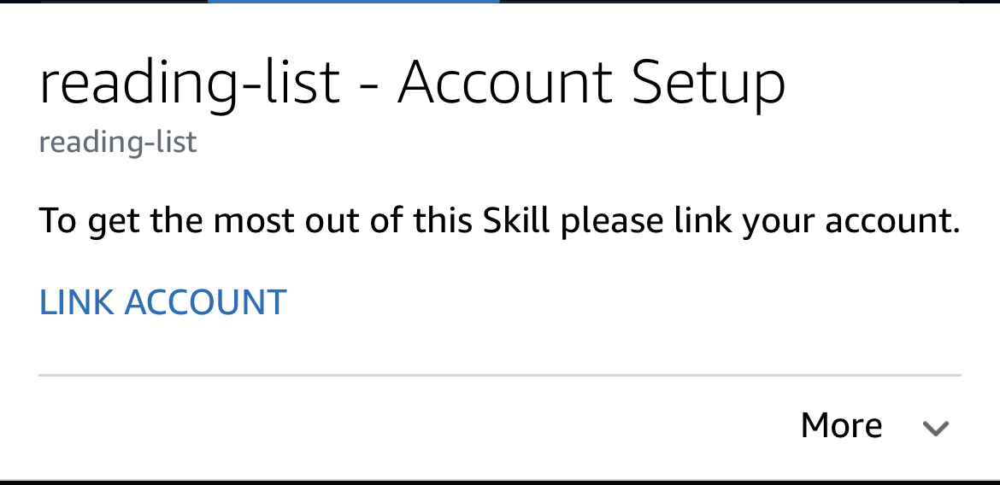
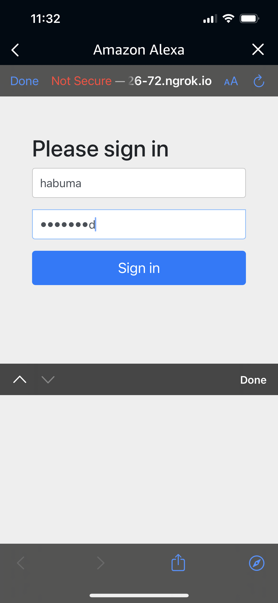
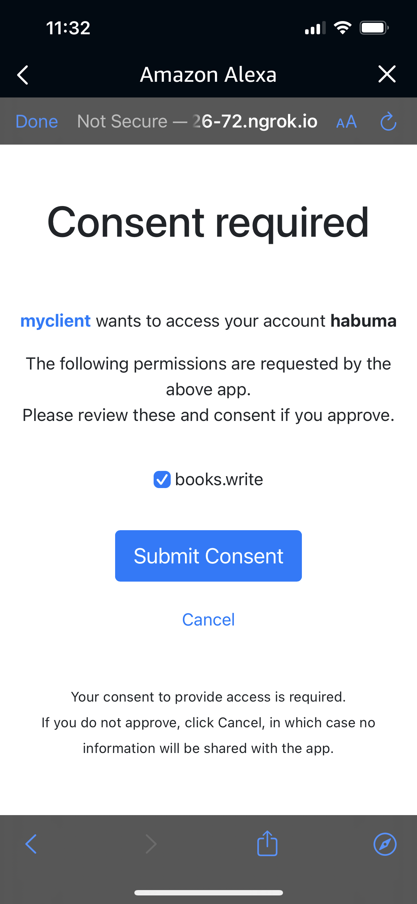

Reading List - The Alexa Skill
==============================
The Reading List Alexa skill is the voice user interface and
client of the books API. It was originally created as an
Alexa-hosted skill. Therefore, in order for you to deploy it
you'll need to create a new Alexa skill with your Amazon
developer account and then copy the relevant code from this
project into your project.

Re-creating the Skill Project
-----------------------------
To create a new Alexa skill, you'll need an [Amazon developer](https://developer.amazon.com/)
account. You can either create the new skill in the developer
console or using the [ASK CLI](https://developer.amazon.com/en-US/docs/alexa/smapi/ask-cli-intro.html).

Here's an example of how I used the ASK CLI to create the
skill project initially.

~~~
$ ask new
Please follow the wizard to start your Alexa skill project ->
? Choose the programming language you will use to code your skill:  NodeJS
? Choose a method to host your skill's backend resources:  Alexa-hosted skills
  Host your skill code by Alexa (free).
? Choose the default region for your skill:  us-east-1
? Please type in your skill name:  reading-list
? Please type in your folder name for the skill project (alphanumeric):  reading-list

Project directory for reading-list created at
	/Users/habuma/myprojects/reading-list

Lambda code for reading-list created at
	./lambda

Skill schema and interactionModels for reading-list created at
	./skill-package

Skill is enabled successfully.
Hosted skill provisioning finished. Skill-Id: amzn1.ask.skill.8ef6c977-8ba6-480d-998a-8e2702381ccf
Please follow the instructions at https://developer.amazon.com/en-US/docs/alexa/hosted-skills/alexa-hosted-skills-ask-cli.html to learn more about the usage of "git" for Hosted skill.
~~~

After the project has been created, you can copy almost
everything from this reading list project into your new
project directory, except for `skill-package/skill.json`. Then, use Git to commit the changes to your new project.
After a minute or so, the skill should be deployed.

Smoke Testing
-------------
Ultimately, the skill will need the authorization server
and books API running to be able to use the AddBook and
ListBooks intents. But I've left the HelloWorld intent in
place to do a basic smoke test.

You can test using any Alexa device attached to the same
Amazon account as your developer account. But a simpler
test can be performed using the ASK CLI. Here's an example
of using the ASK CLI's `dialog` command to test the
HelloWorld intent:

~~~
$ ask dialog
Defaulting locale to the first value from the skill manifest: en-US

User  > open reading list
Alexa > Welcome, you can say Hello or Help. Which would you like to try?
User  > hello
Alexa > Hello World!
User  > .quit
~~~

Integrating with the books API
------------------------------
This skill uses a technique called "account linking" to
obtain an access token from an OAuth2 authorization server.
Once the token has been obtained, it will be provided in
every request sent to the skill. The skill can then use that
token to make requests to an API that requires it for
authorization.

In a real world situation, all components would be deployed
in the cloud. But for the purposes of kicking the tires on
this, these instructions will describe how to set it up so
that everything runs locally on your machine.

First, start up the authorization server and books API by
following the instructions in those projects' README
documentation. After doing that, the authorization server
should be listening for requests on port 9000 and the books
API should be listening on port 8081.

You'll be running the Alexa skill code locally, so it will
be able to make requests to the books API at localhost 8081
with no problem. But for authorization purposes, the auth
server will need to be accessible from outside of your
machine. The [`ngrok`](https://ngrok.com/) tool can help with that:

~~~
% ngrok http 9000
~~~

After running `ngrok`, copy the HTTPS URL that is printed
and paste it into the authorization and access token URLs
in `linking.json` as the base URL (keep the URL paths--
`/oauth2/authorize` and `/oauth2/token`--in place).

For the next step, you'll need your skill's ID. There are
a number of ways to get the skill ID, but the easiest is
to inspect the `.ask/ask-states.json` file (in the skill,
project that you created, not my project).

With the skill ID in hand, execute this ASK CLI command to
apply the account linking details to your skill:

~~~
% ask smapi update-account-linking-info \
  --skill-id <<YOUR SKILL ID>> \
  --account-linking-request file:linking.json
~~~

The account linking information uses the URL created by
`ngrok`. If you stop `ngrok` and restart it later, you'll
likely get a new URL and will need to edit `linking.json`
and reapply the new information using the same ASK CLI
command again.

Running the Skill Locally
-------------------------
To run the skill code locally, use the ASK CLI:

~~~
% ask run --watch
~~~

The `ask run` command leverages the "ask-sdk-local-debug"
module to redirect requests from Alexa to the code running
on your local machine instead of the code deployed in AWS
Lambda. The `--watch` parameter tells it to watch for any
changes and restart the session if you change the local
code.

Testing the Full Integration
----------------------------
In a separate shell, run `ask dialog`. At the "User>"
prompt, type "ask reading list to add to kill a mockingbird".
If everything is working and if you've not already authorized
the skill to access the API, it will tell you to link your
account in the Alexa app.

The interaction should look something like this:

~~~
User  > ask reading list to add to kill a mockingbird
Alexa > I need permission to add books to your reading list. Please link your account in the Alexa app.
~~~

Open the Alexa companion app on your mobile phone. Click
on the "More" icon on the bottom right, and then click on
"Activity". Assuming that it is signed into the same account
as your developer account, you should see a "card" asking
you to link your account. The card will look a little like
this:

Click on "LINK ACCOUNT". Assuming that your phone can reach
the authorization server (via the `ngrok` URL), you should
see the authorization server's sign-in page:

Sign in as "habuma" with "password" as the password. You
will then be asked to grant consent for the "books.write"
permission:

Check the checkbox and click "Submit Consent". At this
point, the skill should have permission to write new books
through the books API.

Back in `ask dialog`, try to add the book again. This time
it should work.

~~~
User  > ask reading list to add to kill a mockingbird
Alexa > Adding To Kill a Mockingbird by Harper Lee
~~~

To verify that the book was added, ask the reading list
skill to list all books:

~~~
User  > ask reading list to list books
Alexa > Here are the books in your library: Harry Potter and the Sorcerer's Stone by J.K. Rowling, The Shining by Stephen King, To Kill a Mockingbird by Harper Lee ,
~~~

The first two books are the books that were added as test
data in the books API. The third book is the one that was
added by interacting with the Alexa skill.

Real World Deployment
---------------------
If this were to be deployed in the real world, only a few
things would differ:

 - The authorization server and books API would not be
   running locally. They would likely be deployed in the
   cloud somewhere.
   - Although not required, the authorization server
     would likely be enhanced to support users and clients
     that aren't hardcoded in the security configuration.
 - The URLs in the account linking JSON file would refer
   to the URLs for the authorization server, wherever it
   may be deployed.
 - The URLs in the skill's  `ListBooksIntentHandler.js` and
   `AddBookIntentHandler.js` would refer to the correct
   host of the books API as deployed in the cloud instead
   of "localhost:8081".
 - The Alexa skill would at least be deployed with the
   previous change (for your own use) or published (for
   access by the greater Alexa user community).

For More Details
----------------
The Alexa skill also employs Alexa entity resolution to
look up additional information about a book. That's how
it knew that "To Kill a Mockingbird" was written by Harper
Lee even though you didn't say that.

If you're new to developing for Alexa or are just wanting
to learn more, check out my book "Build Talking Apps for
Alexa" at [Amazon](http://www.amazon.com/gp/product/1680507257/?tag=habumacom-20)
or [PragProg.com](https://pragprog.com/titles/cwalexa/build-talking-apps-for-alexa/). It covers account linking,
Alexa entities, and much much more.
